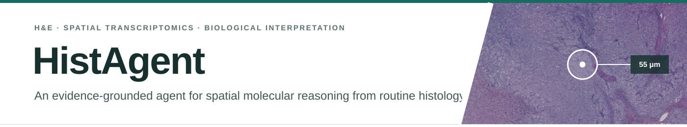
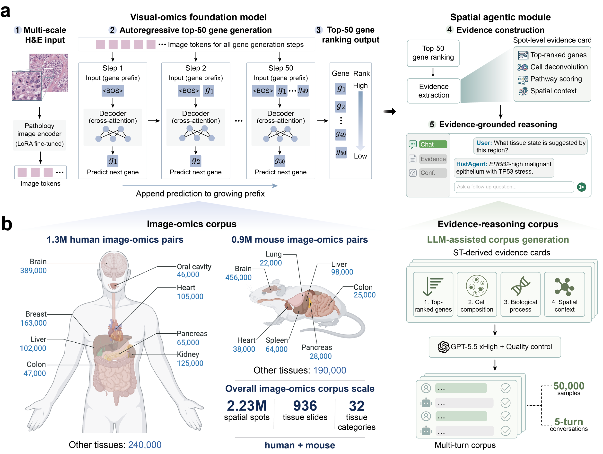

<p align="center">
  
</p>

<p align="center">
  <a href="https://github.com/zipging/HistAgent"></a>
  <a href="https://huggingface.co/wli13/HistAgent"></a>
  <a href="https://huggingface.co/wli14/HistAgent-Qwen3-8B-LoRA"></a>
  <a href="https://huggingface.co/datasets/wli13/HistAgent-data"></a>
  
  
</p>

## Overview

**HistAgent** connects spatial molecular inference from routine H&E images with evidence-grounded reasoning about local tissue states. Its visual-omics foundation model uses a spot-centred view together with surrounding tissue context to autoregressively generate a ranked molecular readout. Rank-derived analyses can then organise these readouts into molecular and spatial evidence for biological interpretation.

This repository provides the GigaPath-backed visual-omics model and spatial agentic module used by HistAgent, including model code, preprocessing, ranked-gene inference and interactive analysis.

## Framework

<p align="center">
  
</p>

HistAgent combines:

- **Dual-scale H&E encoding** of local morphology and its surrounding tissue context.
- **Rank-based molecular generation** of the top 50 genes at each tissue location.
- **LoRA adaptation of GigaPath** together with trainable dual-stream projectors and an autoregressive gene decoder.
- **Structured spatial evidence** derived from ranked genes, cell composition, functional programmes and spatial context.

## Model release

| Component | Base model | Output | Checkpoint |
|---|---|---|---|
| Visual-omics foundation model | [Prov-GigaPath](https://huggingface.co/prov-gigapath/prov-gigapath) with LoRA | Ranked top-50 genes | [Hugging Face](https://huggingface.co/wli13/HistAgent) |
| Spatial agentic module | [Qwen3-8B](https://huggingface.co/Qwen/Qwen3-8B) with LoRA | Evidence-grounded multi-turn answers | [Hugging Face](https://huggingface.co/wli14/HistAgent-Qwen3-8B-LoRA) |

The visual-model checkpoint contains HistAgent's trained LoRA parameters and all non-GigaPath modules. The original GigaPath parameters are loaded from the official model repository and are not redistributed. The language-model adapter is loaded on top of Qwen3-8B.

## Results at a glance

Across 135 held-out human and mouse ST slides from 15 organ cohorts, HistAgent more accurately recovered local molecular composition than STPath and OmiCLIP.

| Evaluation | HistAgent | STPath | OmiCLIP |
|---|---:|---:|---:|
| Mean HitRate@50 | **0.699** | 0.292 | 0.410 |
| Mean mAP@50 | **0.655** | 0.167 | 0.311 |

## System requirements and tested environment

HistAgent requires Python 3.10 or newer. The core package declares the following
software dependencies in `pyproject.toml`:

| Dependency | Declared version |
|---|---|
| PyTorch | `>=2.2` |
| torchvision | `>=0.17` |
| timm | `>=1.0.3` |
| PEFT | `>=0.13,<0.14` |
| huggingface-hub | `>=0.24` |
| Pillow | `>=10` |
| safetensors | `>=0.4` |

The lightweight release checks were most recently run on macOS 26.2 (Apple silicon) with
Python 3.12.4, PyTorch 2.13.0, torchvision 0.28.0, timm 1.0.28, PEFT 0.13.2,
huggingface-hub 1.25.1, Pillow 12.0.0 and safetensors 0.8.0. All six lightweight
tests passed in this environment. These tests cover tokenizer consistency,
checkpoint export filtering and clinical utilities; access-controlled
Prov-GigaPath loading is not exercised by the release test suite. The versions
above record one tested QA environment rather than an exhaustive compatibility
matrix. Full visual-omics training and GPU inference were run on Linux with
NVIDIA CUDA GPUs; the released 30-epoch training run used eight NVIDIA H100
80-GB GPUs.

For visual-omics inference, an NVIDIA CUDA GPU with at least 24 GB of GPU memory
is recommended. The API accepts `device="cpu"`, but CPU-only inference is not
recommended and has not been benchmarked. Local use of the Qwen3-8B language
adapter similarly requires a CUDA GPU with approximately 20 GB of free GPU
memory. Windows has not been tested.

## Installation

```bash
git clone https://github.com/zipging/HistAgent.git
cd HistAgent
pip install -e .
```

Prov-GigaPath is gated on Hugging Face. Before first use, request access on the [official model page](https://huggingface.co/prov-gigapath/prov-gigapath) and authenticate with a read token:

```bash
export HF_TOKEN="your_read_token"
```

Allow approximately 5--15 min to install the Python package on a broadband
connection; the actual time depends mainly on whether a compatible PyTorch
installation is already present. This estimate excludes the time required to
obtain access to the gated Prov-GigaPath repository. The first model load
downloads the 378-MB HistAgent checkpoint and the several-gigabyte Prov-GigaPath
checkpoint; download time is network dependent. Subsequent runs use the local
Hugging Face cache.

## Quick start

HistAgent receives two H&E crops centred on the same location: a local view and a broader context view. Both are converted to 224 × 224 pixels before encoding.

```python
import torch
from huggingface_hub import hf_hub_download

from histagent import load_pretrained, predict_ranked_genes

local_image = hf_hub_download(
    "wli13/HistAgent-data",
    "tutorials/figure5_he_query_brain_local.png",
    repo_type="dataset",
)
context_image = hf_hub_download(
    "wli13/HistAgent-data",
    "tutorials/figure5_he_query_brain_context.png",
    repo_type="dataset",
)

device = "cuda" if torch.cuda.is_available() else "cpu"
model, tokenizer, _ = load_pretrained(device=device)

genes = predict_ranked_genes(
    model,
    tokenizer,
    local_image=local_image,
    context_image=context_image,
    organ="brain",
    species="human",
    top_k=50,
    device=device,
)
print(genes)
```

The same inference is available from the command line:

```bash
hf download wli13/HistAgent-data \
  tutorials/figure5_he_query_brain_local.png \
  tutorials/figure5_he_query_brain_context.png \
  --type dataset \
  --local-dir demo_data

histagent-predict \
  --local demo_data/tutorials/figure5_he_query_brain_local.png \
  --context demo_data/tutorials/figure5_he_query_brain_context.png \
  --organ brain \
  --species human
```

To use an already downloaded GigaPath checkpoint, pass `base_checkpoint_path` to `load_pretrained` or `--base-checkpoint` to the command-line interface.

### Expected demo output and run time

The Python demo returns a list of up to 50 gene symbols ordered from the
highest-ranked to the lowest-ranked prediction. The command-line interface prints
the same genes as one space-delimited line, for example:

```text
GENE_1 GENE_2 ... GENE_50
```

The exact genes are model predictions and depend on the input image pair, organ
and species. The public [HistAgent demo](https://huggingface.co/spaces/wli13/HistAgent-demo)
uses an NVIDIA A10G 24-GB GPU and requests a GPU allocation of up to 180 s for one
image pair. Queueing, cold-start and initial model-download times are additional
and depend on service load and network speed. CPU-only demo run time has not been
characterized.

## Clinical prediction API

Install the optional analysis dependencies to run the clinical tutorial:

```bash
pip install -e ".[clinical]"
```

The public interface loads the released HistAgent tile representations and
trained ABMIL checkpoints, then performs tile inference, spatial mapping,
region tests and survival analysis:

```python
from histagent.clinical import HistAgentClinical

clinical_model = HistAgentClinical.from_data_dir("data/tutorials")
predictions = clinical_model()
region_tests = clinical_model.compare_regions(predictions)

clinical_model.plot_stad(predictions, region_tests)
clinical_model.plot_brca(predictions, region_tests)
```

## Tutorial and Agent Module data

The public data repository contains the files used by the five executed
tutorials and a directly configurable Agent Module bundle:

```python
from huggingface_hub import snapshot_download

data_root = snapshot_download(
    "wli13/HistAgent-data",
    repo_type="dataset",
)
```

The five executed notebooks are available in
[`docs/notebooks`](docs/notebooks) and as rendered
[HistAgent tutorials](https://histagent.bio/tutorials/). Each notebook contains
its installation cell and downloads only the files needed for that workflow.
To run a notebook locally:

```bash
python -m pip install jupyter
python -m jupyter lab
```

Open the downloaded `.ipynb` file in Jupyter and choose **Run All**.

The Agent Module runs as two processes: an OpenAI-compatible language model and
the Web/API service. The repository includes a local Qwen3-8B server, or you can
configure another compatible endpoint. See
[examples/chat/README.md](examples/chat/README.md) for the two-terminal startup
commands and the additional requirements for H&E image analysis.

## Repository layout

```text
HistAgent/
├── src/histagent/          # model, checkpoint loader and inference API
├── examples/chat/          # configurable Agent Module service and Spot Chat
├── scripts/                # training and checkpoint export utilities
├── vocab/                  # gene, organ and species vocabularies
├── tests/                  # lightweight release checks
└── assets/                 # framework and repository graphics
```

## Training configuration

The released model was trained for 30 epochs on 2.23 million paired H&E–ST locations from 936 human and mouse 10x Visium slides. The complete training run required approximately 103 h on eight NVIDIA H100 GPUs. The model uses a shared GigaPath tile encoder with rank-16 LoRA, separate local and context resamplers, and a six-layer Transformer decoder. Earlier positions in each gene sentence receive greater weight during training.

## Citation

The HistAgent manuscript and citation will be added here when publicly available.

## License

HistAgent source code is released under the
[Apache License 2.0](LICENSE). Third-party models and datasets are not
relicensed by this repository and remain subject to their original licenses,
access conditions and terms of use.

## Acknowledgements

HistAgent builds on [Prov-GigaPath](https://github.com/prov-gigapath/prov-gigapath) and [Qwen3-8B](https://huggingface.co/Qwen/Qwen3-8B). Users must comply with their respective access conditions and licenses.

## Intended use

HistAgent is provided for research use. Its molecular readouts are predictions from histology and should not be treated as measured transcript counts or used for clinical decision-making without independent validation.
