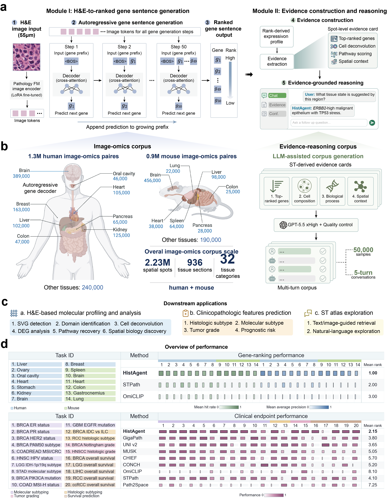

<p align="center">
  
</p>

<p align="center">
  <a href="https://github.com/zipging/HistAgent"></a>
  <a href="https://huggingface.co/wli13/HistAgent-GigaPath"></a>
  
  
</p>

## Overview

**HistAgent** connects spatial molecular inference from routine H&E images with evidence-grounded reasoning about local tissue states. Its visual-omics foundation model uses a spot-centred view together with surrounding tissue context to autoregressively generate a ranked molecular readout. Rank-derived analyses can then organise these readouts into molecular and spatial evidence for biological interpretation.

This repository provides the GigaPath-backed visual-omics model used by HistAgent, including model code, preprocessing, ranked-gene inference and the trained checkpoint.

## Framework

<p align="center">
  
</p>

HistAgent combines:

- **Dual-scale H&E encoding** of local morphology and its surrounding tissue context.
- **Rank-based molecular generation** of the top 50 genes at each tissue location.
- **LoRA adaptation of GigaPath** together with trainable dual-stream projectors and an autoregressive gene decoder.
- **Structured spatial evidence** derived from ranked genes, cell composition, functional programmes and spatial context.

## Model release

| Model | Base encoder | Output | Checkpoint |
|---|---|---|---|
| HistAgent-GigaPath | [Prov-GigaPath](https://huggingface.co/prov-gigapath/prov-gigapath) with LoRA | Ranked top-50 genes | [Hugging Face](https://huggingface.co/wli13/HistAgent-GigaPath) |

The released checkpoint contains HistAgent's trained LoRA parameters and all non-GigaPath modules. The original GigaPath parameters are loaded from the official model repository and are not redistributed.

## Installation

```bash
git clone https://github.com/zipging/HistAgent.git
cd HistAgent
pip install -e .
```

Prov-GigaPath is gated on Hugging Face. Before first use, request access on the [official model page](https://huggingface.co/prov-gigapath/prov-gigapath) and authenticate with a read token:

```bash
export HF_TOKEN="your_read_token"
```

## Quick start

HistAgent receives two H&E crops centred on the same location: a local view and a broader context view. Both are converted to 224 × 224 pixels before encoding.

```python
import torch

from histagent import load_pretrained, predict_ranked_genes

device = "cuda" if torch.cuda.is_available() else "cpu"
model, tokenizer, _ = load_pretrained(device=device)

genes = predict_ranked_genes(
    model,
    tokenizer,
    local_image="examples/local.png",
    context_image="examples/context.png",
    organ="breast",
    species="human",
    top_k=50,
    device=device,
)
print(genes)
```

The same inference is available from the command line:

```bash
histagent-predict \
  --local examples/local.png \
  --context examples/context.png \
  --organ breast \
  --species human
```

To use an already downloaded GigaPath checkpoint, pass `base_checkpoint_path` to `load_pretrained` or `--base-checkpoint` to the command-line interface.

## Repository layout

```text
HistAgent/
├── src/histagent/          # model, checkpoint loader and inference API
├── scripts/                # training and checkpoint export utilities
├── vocab/                  # gene, organ and species vocabularies
├── tests/                  # lightweight release checks
└── assets/                 # framework and repository graphics
```

## Training configuration

The released model was trained for 30 epochs on 2.23 million paired H&E–ST locations from 936 human and mouse 10x Visium slides. The model uses a shared GigaPath tile encoder with rank-16 LoRA, separate local and context resamplers, and a six-layer Transformer decoder. Earlier positions in each gene sentence receive greater weight during training.

## Citation

The HistAgent manuscript and citation will be added here when publicly available.

## Acknowledgements

HistAgent builds on [Prov-GigaPath](https://github.com/prov-gigapath/prov-gigapath). Users must comply with the access conditions and license of the original GigaPath model.

## Intended use

HistAgent is provided for research use. Its molecular readouts are predictions from histology and should not be treated as measured transcript counts or used for clinical decision-making without independent validation.
