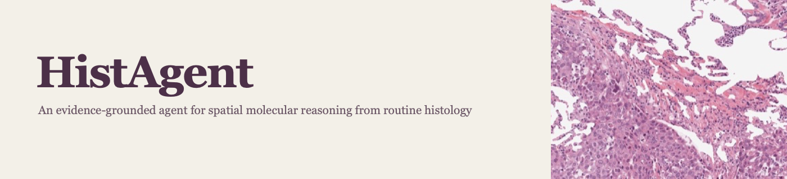

<p align="center">
  
</p>

<p align="center">
  <a href="https://github.com/zipging/HistAgent"></a>
  <a href="https://huggingface.co/wli13/HistAgent"></a>
  <a href="https://huggingface.co/wli14/HistAgent-Qwen3-8B-LoRA"></a>
  <a href="https://huggingface.co/datasets/wli13/HistAgent-data"></a>
  
  
</p>

## Overview

**HistAgent** connects spatial molecular inference from routine H&E images with evidence-grounded reasoning about local tissue states. Its visual-omics foundation model uses a spot-centred view together with surrounding tissue context to autoregressively generate a ranked molecular readout. Rank-derived analyses can then organise these readouts into molecular and spatial evidence for biological interpretation.

This repository provides the GigaPath-backed visual-omics model and spatial agentic module used by HistAgent, including model code, preprocessing, ranked-gene inference and interactive analysis.

## Framework

<p align="center">
  
</p>

HistAgent combines:

- **Dual-scale H&E encoding** of local morphology and its surrounding tissue context.
- **Rank-based molecular generation** of the top 50 genes at each tissue location.
- **LoRA adaptation of GigaPath** together with trainable dual-stream projectors and an autoregressive gene decoder.
- **Structured spatial evidence** derived from ranked genes, cell composition, functional programmes and spatial context.

## Model release

| Component | Base model | Output | Checkpoint |
|---|---|---|---|
| Visual-omics foundation model | [Prov-GigaPath](https://huggingface.co/prov-gigapath/prov-gigapath) with LoRA | Ranked top-50 genes | [Hugging Face](https://huggingface.co/wli13/HistAgent) |
| Spatial agentic module | [Qwen3-8B](https://huggingface.co/Qwen/Qwen3-8B) with LoRA | Evidence-grounded multi-turn answers | [Hugging Face](https://huggingface.co/wli14/HistAgent-Qwen3-8B-LoRA) |

The visual-model checkpoint contains HistAgent's trained LoRA parameters and all non-GigaPath modules. The original GigaPath parameters are loaded from the official model repository and are not redistributed. The language-model adapter is loaded on top of Qwen3-8B.

## Results at a glance

Across 135 held-out human and mouse ST slides from 15 organ cohorts, HistAgent more accurately recovered local molecular composition than STPath and OmiCLIP.

| Evaluation | HistAgent | STPath | OmiCLIP |
|---|---:|---:|---:|
| Mean HitRate@50 | **0.699** | 0.292 | 0.410 |
| Mean mAP@50 | **0.655** | 0.167 | 0.311 |

## Installation

```bash
git clone https://github.com/zipging/HistAgent.git
cd HistAgent
pip install -e .
```

Prov-GigaPath is gated on Hugging Face. Before first use, request access on the [official model page](https://huggingface.co/prov-gigapath/prov-gigapath) and authenticate with a read token:

```bash
export HF_TOKEN="your_read_token"
```

## Quick start

HistAgent receives two H&E crops centred on the same location: a local view and a broader context view. Both are converted to 224 × 224 pixels before encoding.

```python
import torch

from histagent import load_pretrained, predict_ranked_genes

device = "cuda" if torch.cuda.is_available() else "cpu"
model, tokenizer, _ = load_pretrained(device=device)

genes = predict_ranked_genes(
    model,
    tokenizer,
    local_image="examples/local.png",
    context_image="examples/context.png",
    organ="breast",
    species="human",
    top_k=50,
    device=device,
)
print(genes)
```

The same inference is available from the command line:

```bash
histagent-predict \
  --local examples/local.png \
  --context examples/context.png \
  --organ breast \
  --species human
```

To use an already downloaded GigaPath checkpoint, pass `base_checkpoint_path` to `load_pretrained` or `--base-checkpoint` to the command-line interface.

## Clinical prediction API

Install the optional analysis dependencies to run the clinical tutorial:

```bash
pip install -e ".[clinical]"
```

The public interface loads the released HistAgent tile representations and
trained ABMIL checkpoints, then performs tile inference, spatial mapping,
region tests and survival analysis:

```python
from histagent.clinical import HistAgentClinical

clinical_model = HistAgentClinical.from_data_dir("data/tutorials")
predictions = clinical_model()
region_tests = clinical_model.compare_regions(predictions)

clinical_model.plot_stad(predictions, region_tests)
clinical_model.plot_brca(predictions, region_tests)
```

## Tutorial and Agent Module data

The public data repository contains the files used by the five executed
tutorials and a directly configurable Agent Module bundle:

```python
from huggingface_hub import snapshot_download

data_root = snapshot_download(
    "wli13/HistAgent-data",
    repo_type="dataset",
)
```

Download the executed notebooks from the
[HistAgent tutorials](https://zipging.github.io/HistAgent/tutorials/). Each
notebook contains its installation cell and downloads only the files needed for
that workflow. To run a downloaded notebook locally:

```bash
python -m pip install jupyter
python -m jupyter lab
```

Open the downloaded `.ipynb` file in Jupyter and choose **Run All**.

The Agent Module runs as two processes: an OpenAI-compatible language model and
the Web/API service. The repository includes a local Qwen3-8B server, or you can
configure another compatible endpoint. See
[examples/chat/README.md](examples/chat/README.md) for the two-terminal startup
commands and the additional requirements for H&E image analysis.

## Repository layout

```text
HistAgent/
├── src/histagent/          # model, checkpoint loader and inference API
├── examples/chat/          # configurable Agent Module service and Spot Chat
├── scripts/                # training and checkpoint export utilities
├── vocab/                  # gene, organ and species vocabularies
├── tests/                  # lightweight release checks
└── assets/                 # framework and repository graphics
```

## Training configuration

The released model was trained for 30 epochs on 2.23 million paired H&E–ST locations from 936 human and mouse 10x Visium slides. The complete training run required approximately 103 h on eight NVIDIA H100 GPUs. The model uses a shared GigaPath tile encoder with rank-16 LoRA, separate local and context resamplers, and a six-layer Transformer decoder. Earlier positions in each generated ranking receive greater weight during training.

## Citation

The HistAgent manuscript and citation will be added here when publicly available.

## Acknowledgements

HistAgent builds on [Prov-GigaPath](https://github.com/prov-gigapath/prov-gigapath) and [Qwen3-8B](https://huggingface.co/Qwen/Qwen3-8B). Users must comply with their respective access conditions and licenses.

## Intended use

HistAgent is provided for research use. Its molecular readouts are predictions from histology and should not be treated as measured transcript counts or used for clinical decision-making without independent validation.
